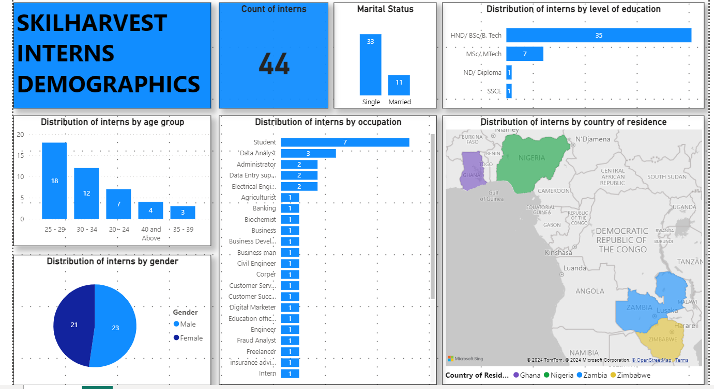

# SkilHarvest-Cohort-2-Data-Analysis-Demography-Survey
This is a demographic survey of the SkilHarvest Cohort 2 Data Analysis Class

**Documentation Outline**
- [Project overview](#project-overview)
- [Data Sources](#data-sources)
- [Tools for analysis](#tools-for-analysis)
- [Data Cleaning and Preparation](#data-cleaning-and-preparation)
- [Results and Findings](#results-and=findings)
- [Recommendations](#recommendations)

# Project overview
This is a study of the demographics of the Data Analysis students at the ongoing SkilHarvest Cohort 2 program. 
It examines the gender, marital status, age, occupation and  their country of residence

# Data Sources

The data used was provided in real time by Mr. TeeDee where a Google form was filled by the students present in class
  
# Tools for analysis

Google forms - For collecting data [Try it out](https://www.google.com/forms/about/)
Google Sheets - For saving responses [Try it out](https://docs.google.com/spreadsheets/u/0/)
Power BI. [You can find it here](https://powerbi.microsoft.com/en-us/downloads/)
  
# Data Cleaning and Preparation

The data was cleaned by removing duplicates from students who filled the form twice and blanks removed

# Results and Findings

Here is pictorial view of the results

Insights from the SkilHarvest Interns Demographics
- The number of students who responded to the survey are 44.
- There are 22 male interns and 21 female interns. 33 interns are single while 11 interns are married.
- The age group with the highest number of interns is 25-29
- Most interns reside in Nigeria, two in Ghana and one each in Zambia and Zimbabwe.
- The interns have various occupations such as data analyst, administrative assistant, data entry operator, electronic engineer while a few of them are students.

# Recommendations

Here are some recommendations from the analysis

1. Diversity and Inclusion Workshops: Given the mix of male and female interns, SkilHarvest can consider organizing workshops or sessions on diversity and inclusion.
These can help foster a supportive and respectful environment for everyone especially women.
  
2. Mentorship Programs: mentorship opportunities for interns can be created.
Experienced professionals can guide them in their respective fields, helping them learn and grow into more complex fields in Data Science and Data Engineering

3. Age-Appropriate activities based on age groups can be explored and created.
For instance, the 25-29 age group can focus on skill development and career advancement.
The 30-34 age group should be encouraged to network and collaborate while for those above the age of 35, opportunities for leadership roles and knowledge sharing should be provided.

4. Occupational growth: SkilHarvest can identify interns' career aspirations and align them with relevant projects or tasks.
Also, offering job placements for outstanding students would go a long way in promoting SkilHarvest especially on the international job market.
